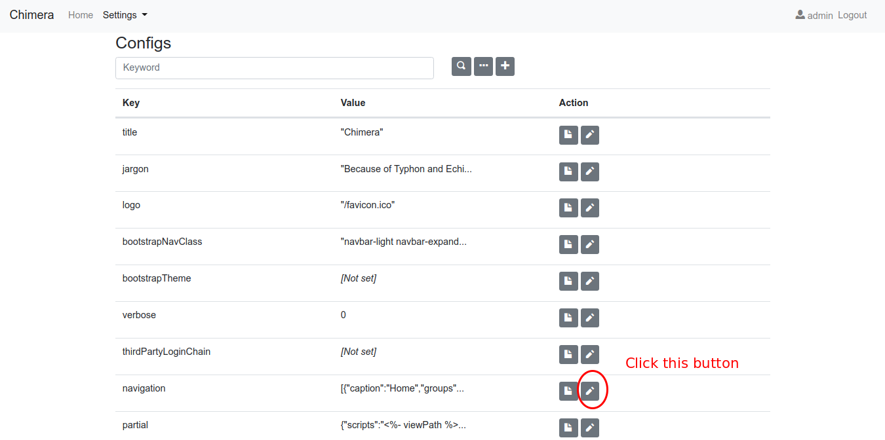

# Agile Development

* Individuals and Interactions over processes and tools
* Working Software over comprehensive documentation
* Customer Collaboration over contract negotiation
* Responding to Change over following a plan

# Tools

* MongoDB
* Node.Js
* NPM (Node Package Manager)
* git (Sofware versioning system)
* Chimera-CMS

# Alternative Tools

* Ruby on Rails (Scaffolding, ORM)
* Laravel (ORM: Eloquent)
* Yii (Generator: GII)

# Installation (Linux)

```bash
sudo apt-get install mongodb node git
npm install -g chimera-framework
```

# Installation (Windows)

* Install mongoDB
  * [https://mongodb.com](https://mongodb.com)
  * [Download](https://www.mongodb.com/dr/fastdl.mongodb.org/win32/mongodb-win32-x86_64-2008plus-ssl-3.6.3-signed.msi/download)
  * Uncheck `install MongoDB Compass`. It takes a very long time
* Prepare mongoDB data directory
  ```
  md \data\db
  ```
* Start mongoDB service
  ```
  "C:\Program Files\MongoDB\Server\3.6\bin\mongod.exe"
  ```
* Install Node.Js
  * [https://nodejs.org](https://nodejs.org)
  * [Download](https://nodejs.org/dist/v9.6.1/node-v9.6.1-x64.msi)
* Install git
  * [https://git-scm.com/download/gui/windows](https://git-scm.com/download/gui/windows)
* Install Chimera Framework
  ```
  npm install -g chimera-framework
  ```

# Generate Project

```bash
gofrendi@asgard:~$ chimera-init-cms myApp
Mongodb Url (mongodb://localhost/myApp): 
[INFO] Read chimera-framework's package.json...
[INFO] Done...
[INFO] Clone CMS...
Cloning into 'myApp'...
[INFO] Done...
[INFO] Creating project's package.json...
[INFO] Done...
[INFO] Creating webConfig.default.js...
[INFO] Done...
[INFO] Creating webConfig.js...
[INFO] Done...
[INFO] Performing npm install...
[INFO] Done...
[INFO] Performing migration...
SuperAdmin username:  admin
SuperAdmin email:  admin@admin.com
SuperAdmin password:  admin
[INFO] Migration succeed
* 0.000-cck up
* 0.001-insert-user up
* 0.002-default-routes up
* 0.003-default-configs up
* 0.004-default-groups up
Complete...
gofrendi@asgard:~$ 
```

# Start Server

```bash
cd myApp
npm start
```

# Access

Open your browser and type this address URL:

```
http://localhost:3000
```

# CCK (Content Construction Kit)

CCK allows you to create CRUD features on the runtime. You can do the following steps in order to create new CRUD:

* Login
* Click `Settings|Content Construction Kit`
* Add new entity by clicking `+` button
  
* Set `Name`, `Collection Name`, `Caption`, and `Fields`
  
* Set `Privileges`
  
* You can now access `http://localhost:3000/data/students`

# Navigation

Rather than typing the URL, it is more convenient to just click a menu. You can do the following steps in order to create a new menu:

* Click `Settings|Configurations`
* Add `Navigation`
  * 
  * 
  * 
  * 
  * 

# CCK On Action

Since you have created an entity and a corresponding menu, Now you can click on `Students` and start adding data

* 
* 

# Other CCK features

* Many2One (e.g: Many students are in the same faculty)
* One2Many (e.g: A student has many hobbies)
* One2Many + Many2One = Many2Many (e.g: A student take many courses, while a single course is taken by many students)

# Other Features

* Theme
* Layout