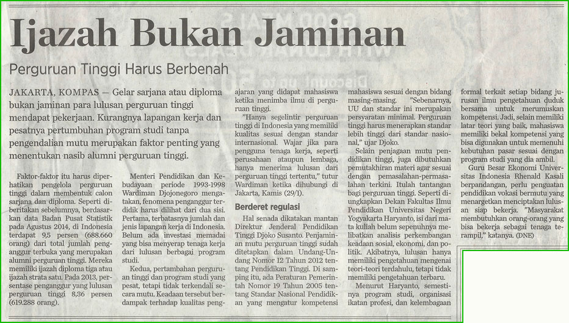
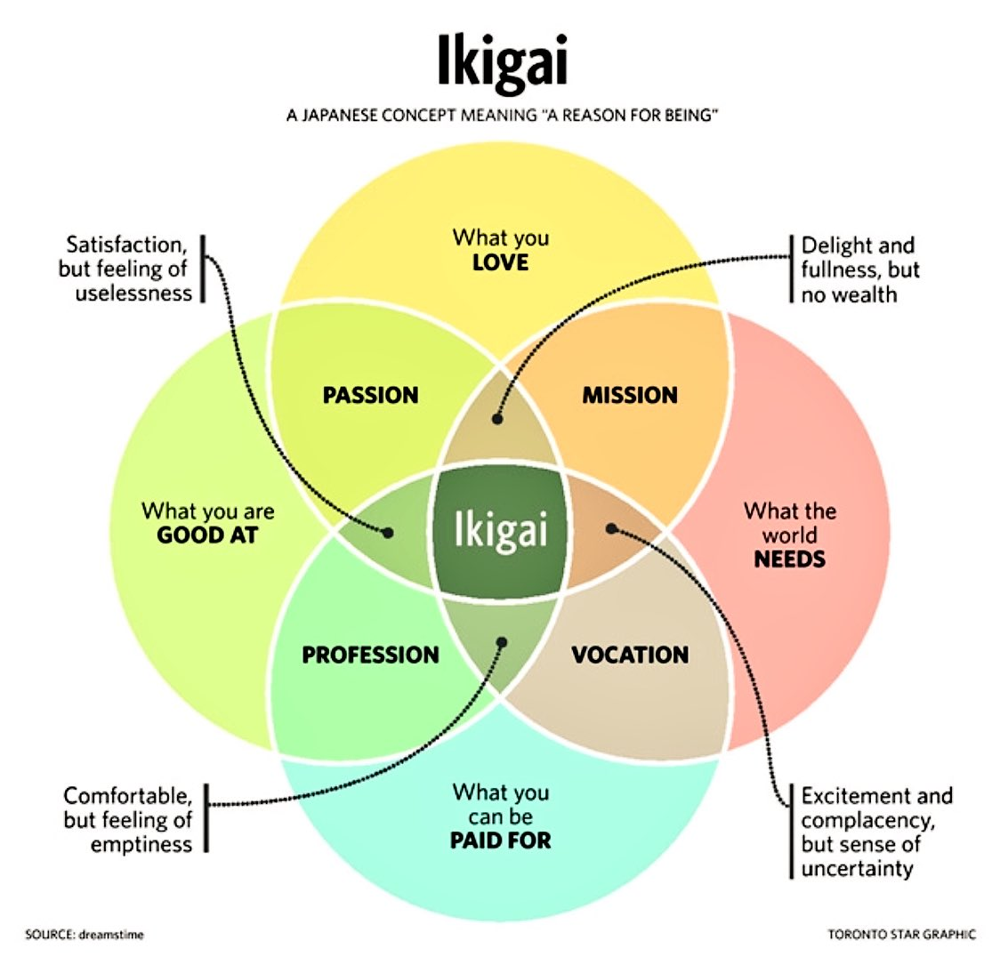

# You are allowed to
* Bring food & drink
* Eat & drink
* Take picture
* Leave the class
* Discuss

# You have to
* Do the assignments
* Keep the class clean
* Mind your manner (otherwise, you have to leave the class)
  * Listen to other's first before stating agreement/disagreement
  * Respect everyone
* Understand questions and provide relevant answers
* Be honest in test (otherwise, you have to leave the subject)

# Score
* 0.2 * assignment + 0.3 * mid-test  + 0.5 * final-test
* Mid-test
  * Online
  * Multiple choice
  * In English
* Final test
  * Project based
  * 4 Progress report
  * Presentation
  * Score: 0.125 * 1st-progress + 0.125 * 2nd-progress + 0.125 * 3rd-progress + 0.125 * 4th-progress + 0.5 * presentation

# Last but not Least

## Certificate?
Certificate do help you for job-seeking etc. But it is not the most important thing!!!

## Ikigai
Hopefully you will find one or two motivation in my class. And hopefully you will find something you can live for to make your life meaningful :)
