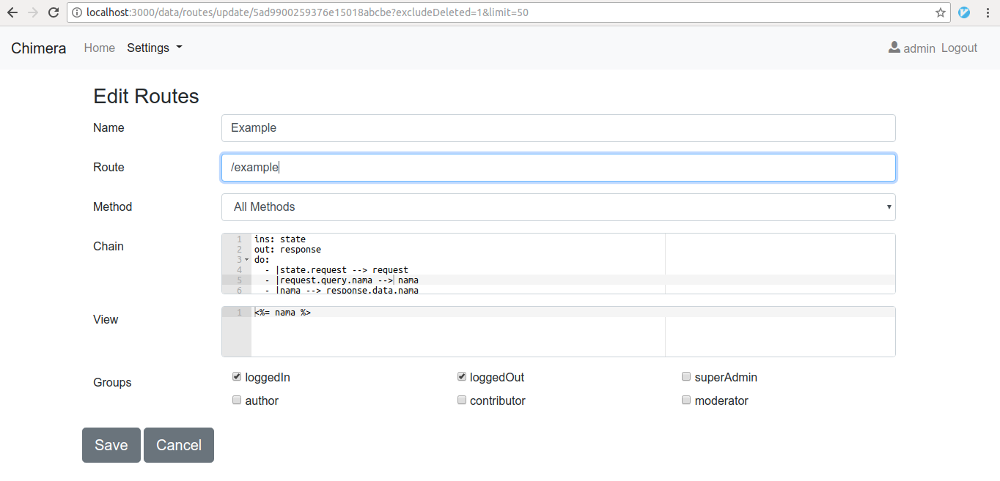
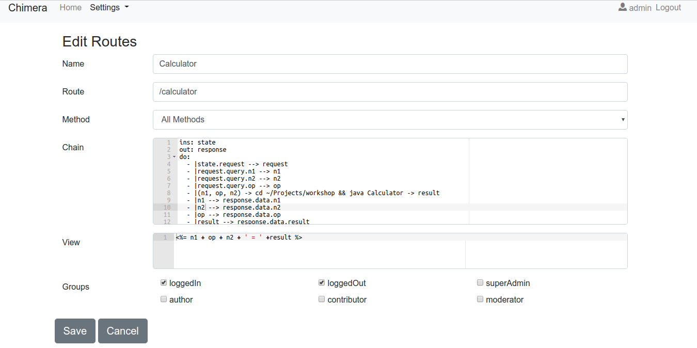

# Preparation

* Install mongodb
* Install Node.Js
* Install Chimera-Framework

```
sudo apt-get install mongodb nodejs
sudo npm install -g chimera-framework
```

# Create Project

```bash
gofrendi@asgard:~/Projects$ chimera-init-cms workshop
Mongodb Url (mongodb://localhost/workshop): 
[INFO] Read chimera-framework's package.json...
[INFO] Done...
[INFO] Clone CMS...
Cloning into 'workshop'...
[INFO] Done...
[INFO] Creating project's package.json...
[INFO] Done...
[INFO] Creating webConfig.js...
[INFO] Done...
[INFO] Creating webConfig.json...
[INFO] Done...
[INFO] Performing npm install...
npm WARN deprecated node-uuid@1.4.8: Use uuid module instead

> nunjucks@3.1.2 postinstall /home/gofrendi/Projects/workshop/node_modules/nunjucks
> node postinstall-build.js src

npm notice created a lockfile as package-lock.json. You should commit this file.
npm WARN workshop@0.0.0 No repository field.
npm WARN optional SKIPPING OPTIONAL DEPENDENCY: fsevents@1.1.3 (node_modules/fsevents):
npm WARN notsup SKIPPING OPTIONAL DEPENDENCY: Unsupported platform for fsevents@1.1.3: wanted {"os":"darwin","arch":"any"} (current: {"os":"linux","arch":"x64"})

added 481 packages from 411 contributors in 15.851s
[INFO] Done...
[INFO] Performing migration...
SuperAdmin username: admin
SuperAdmin email   : admin@admin.com
SuperAdmin password: admin
[INFO] Migration succeed
 * 0.000-cck up
 * 0.001-insert-user up
 * 0.002-default-routes up
 * 0.003-default-configs up
 * 0.004-default-groups up
Complete...
```

# Start the server

```bash
gofrendi@asgard:~/Projects$ cd workshop
gofrendi@asgard:~/Projects/workshop$ npm start

> workshop@0.0.0 start /home/gofrendi/Projects/workshop
> node index.js

Start at port 3000
```

# Create a simple route



# Calculator (java)

```
// File location: ~/Projects/workshop/Calculator.java
// Compilation: javac Calculator.java
// Execution: java Calculator

public class Calculator {
  public static void main(String[] args) {
    if (args.length < 3) {
      System.out.println("Invalid arguments");
    } else {
      // extract number1, operator, and number2 from args
      int number1 = Integer.parseInt(args[0]);
      char operator = args[1].charAt(0);
      int number2 = Integer.parseInt(args[2]);
      // do calculation
      switch (operator) {
        case '+': System.out.println(number1 + number2);
                  break;
        case '-': System.out.println(number1 - number2);
                  break;
        case '*': System.out.println(number1 * number2);
                  break;
        case '/': System.out.println(number1 / number2);
                  break;
        default: System.out.println("Invalid operator");
                 break;
      }
    }
  }
}
```

# Calculator (route)

